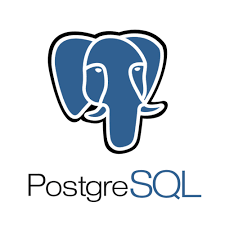

## SEMANA FRONT-END  

###                    Projeto BackEnd e FrontEnd

####                                                     Desenvolvimento do  Banco de Dados:

###### PostgreSQL,  sistema gerenciador de banco de dados objeto relacional, desenvolvido como projeto de código aberto.

https://www.postgresql.org/

###### Docker, conjunto de produtos de plataforma como serviço que usam virtualização de nível de sistema operacional para entregar software em pacotes chamados contêineres. Os contêineres são isolados uns dos outros e agrupam seus próprios softwares, bibliotecas e arquivos de configuração

https://www.docker.com/

####                                                             Desenvolvimento do Front-End:

###### O React é uma biblioteca JavaScript de código aberto com foco em criar interfaces de usuário em páginas web. É mantido pelo Facebook, Instagram, outras empresas e uma comunidade de desenvolvedores individuais.

https://pt-br.reactjs.org/

