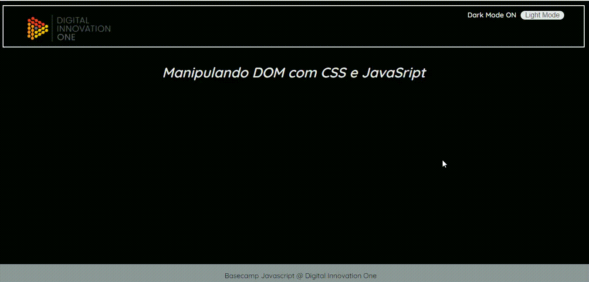

# Metodos JavaScript Manipulando D.O.M.

# 

* document.createElement() - Cria um novo elemento HTML
* document.removeChild()   - Remove um elemento
* document.appendChild()   - Adiciona um elemento
* document.replaceChild()  - Substitui um elemento

# Metodos para Manipular  Estilos.

# 

const meuElemento = document.getElementById(`meu-elemento`)

meuElemento.classList.add("novo-estilo");
// adiciona a classe "meu estilo"

meuElemento.classList.remove("classe");
// Remove a classe "classe"

meuElemento.classList.toggle("dark-mode")
// Adiciona a classe "dark-mode" caso ela não faça parte da lista e remove ela caso faça.
__________________________________________________________________________________________________

document.getElementsByTagName("h1").style.color = "blue";
// acessando diretamente o CSS de um elemento

# Eventos para Manipular D.O.M.

# 

* Eventos do mouse          - mouseover, mouseout

*   Eventos de click          - click, dbclik

*   Eventos de atualização    - change, load

  

const botao = document.getElementById("meuBotao");

botao.addEventListener("click", outraFuncao);

// cria um evento de click diretamente pelo javascript

​    

